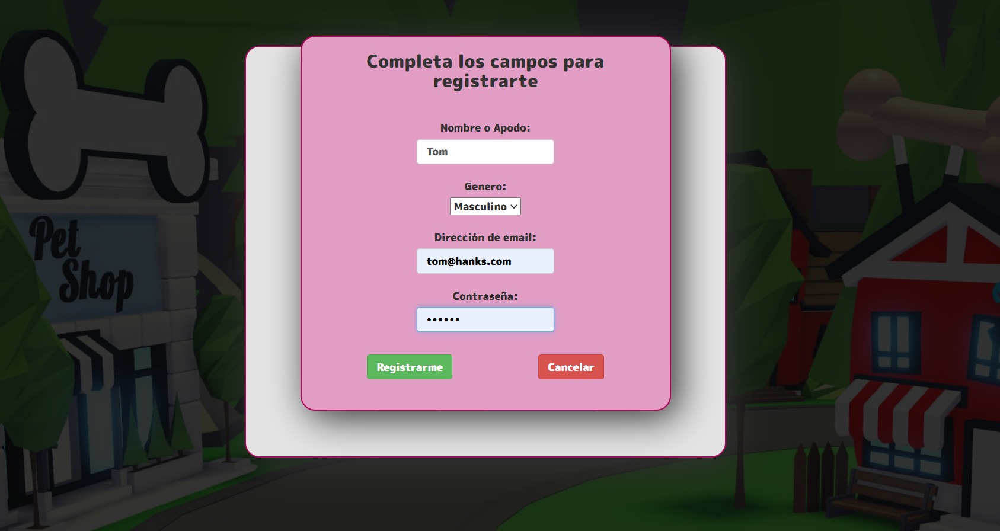
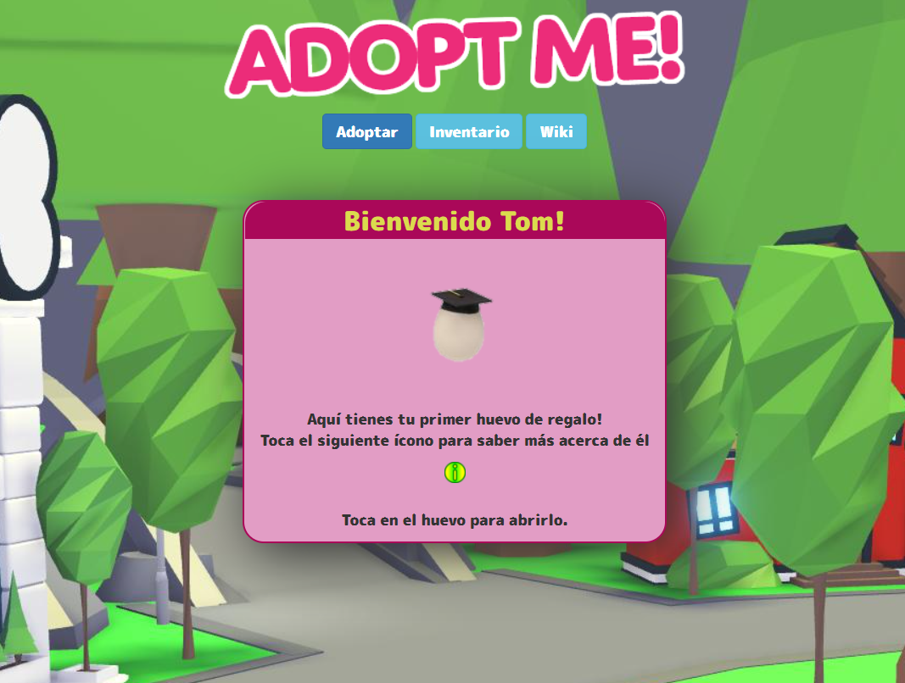
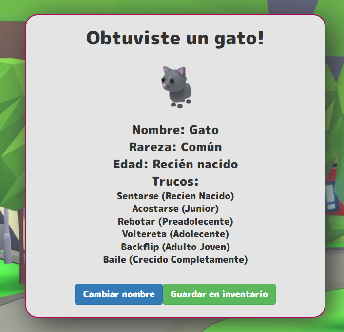
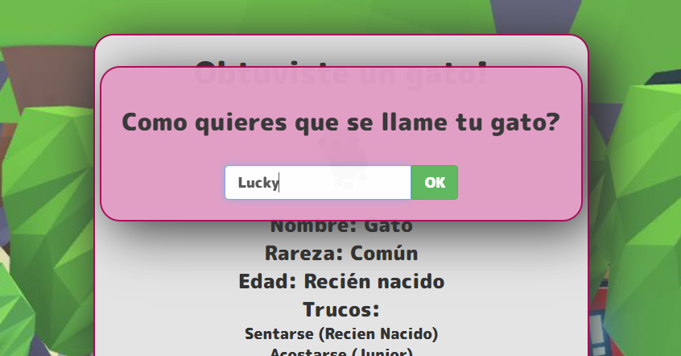
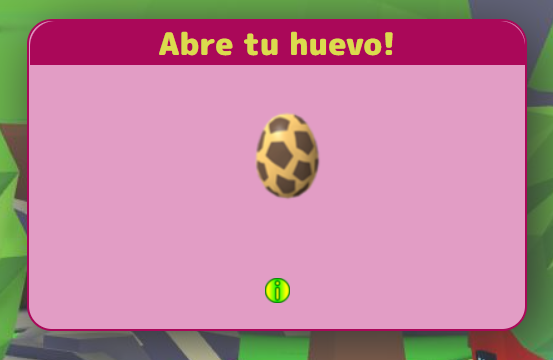
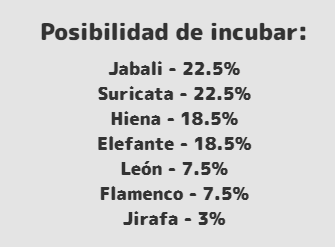
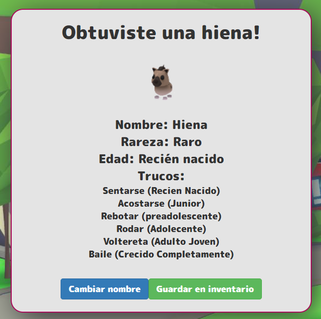
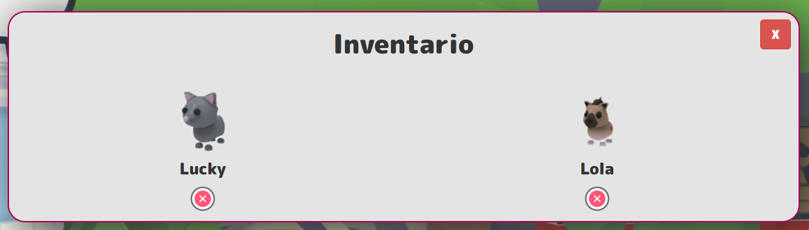
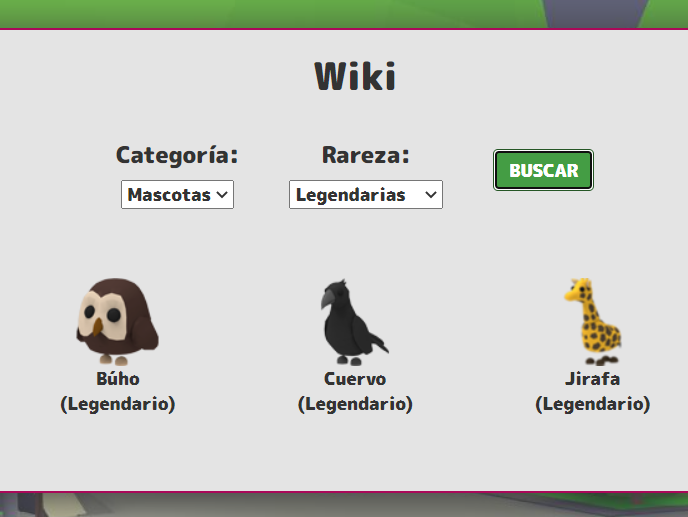

# AdoptMe Web

- Esta app fue realizada durente el transcurso de 3 semanas, en paralelo al aprendizaje de React/Redux/Express del bootcamp Henry. A medida que avancé en mis estudios, fui incorporando herramientas y features a esta app. 
- Planeo continuar desarrollándola, incorporando los conocimientos que luego de aquella etapa fui adquiriendo.

> Realizado utilizando el stack de tecnologías HTML, CSS, Javascript, React, Redux, Node.JS, Express, Sequelize y PostgreSQL.

## Login

- Al ingresar podemos crear una cuenta o iniciar sesión en caso de que ya contemos con una.

  

- Si estamos ingresando por primera vez (usuario nuevo) obtenemos por única vez un huevo especial de regalo de bienvenida.

  

- Al abrirlo obtenemos aleatoreamente una mascota. En esta oportunidad, obtuvimos un gato!

  

- También podemos bautizarlo con el nombre que querramos.

  

- El juego luego nos permite ir obteniendo al azar diferentes tipos de huevos (cada cual con una probabilidad en base a su "rareza")

- En esta oportunidad, obtuvimos un huevo de Safari:

  

- Si queremos conocer más información acerca de este huevo, clickeamos el ícono de info.
- Además de conocer la rareza del huevo, su costo, y otra información, también podemos ver qué mascota podemos obtener de él y sus probabilidades!

  

- Obtuvimos una hiena:

  

- Luego de ponerle un nombre, la guardamos en el inventario y ya tenemos dos mascotas:

  

Podemos coleccionar mascotas en nuestro inventario y tratar de obtener las más "difíciles".

Además posee una sección "Wiki" donde podemos ver todas las mascotas existentes, filtrarlas por tipo, etc. 

  

